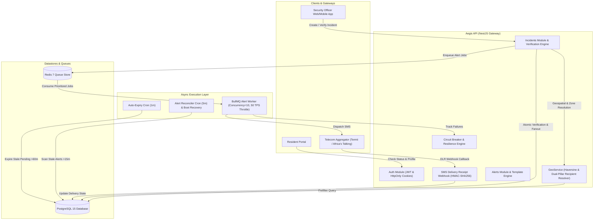
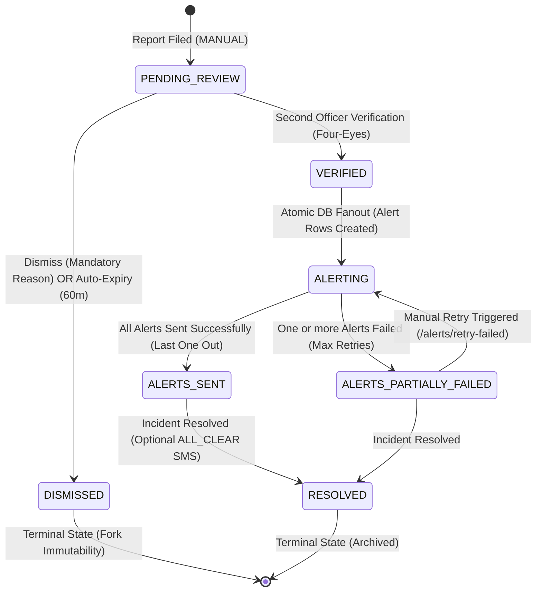
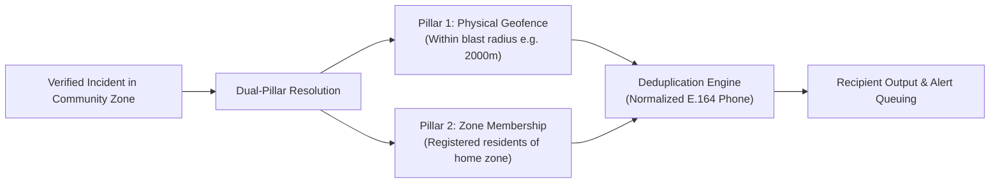
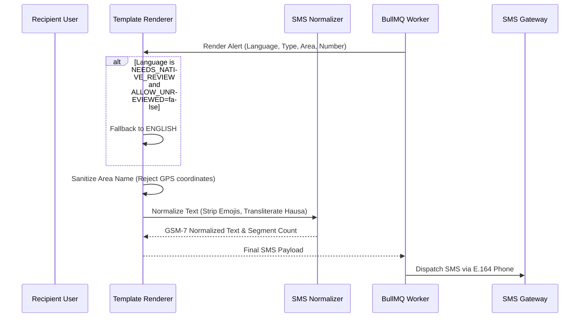
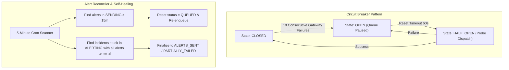

# AEGIS — System Architecture & Technical Design

## 1. System Overview

**Aegis** is an automated community early-warning and verified incident fan-out platform built specifically for high-risk Nigerian communities. It bridges the gap between field-reported security alerts (patrols, community leaders, vigilant residents) and rapid, multi-channel notification.

The backend is built with:
- **Framework:** NestJS 11 (Node.js runtime, TypeScript strict)
- **Database:** PostgreSQL 15+ managed via Prisma ORM
- **Queue & Async Engine:** BullMQ 5+ backed by Redis 7 (with transparent in-memory priority fallback)
- **Logging & Security:** Structured Pino logging with Request correlation IDs, Helmet, Rate limiting, and HttpOnly cookies.

---

## 2. High-Level System Architecture

---

## 3. Incident Lifecycle & Finite State Machine

The incident workflow enforces strict state-transition gates with **optimistic concurrency locking** (`version` column) and a **Four-Eyes verification policy**.

### Transition Matrix Enforcement
| From State | Allowed Target States | Enforcement Policy |
| :--- | :--- | :--- |
| `PENDING_REVIEW` | `VERIFIED`, `DISMISSED` | `ALLOW_SELF_VERIFY=false`: Reporter cannot verify own report. |
| `VERIFIED` | `ALERTING` | Internal atomic transition executed in single DB transaction. |
| `ALERTING` | `ALERTS_SENT`, `ALERTS_PARTIALLY_FAILED` | Automated "Last One Out" check executed by alert worker. |
| `ALERTS_PARTIALLY_FAILED` | `RESOLVED`, `ALERTING` | Re-entering `ALERTING` via `POST /incidents/:id/alerts/retry-failed`. |
| `ALERTS_SENT` | `RESOLVED` | Security officer/Admin resolution action. |
| `DISMISSED` | *(None)* | Strictly terminal; prevents replay or re-activation. |
| `RESOLVED` | *(None)* | Strictly terminal. |

---

## 4. Dual-Pillar Recipient Selection Engine

Unlike standard geofencing systems that only alert people currently within a blast radius, Aegis implements **Dual-Pillar Recipient Selection** to protect Nigerian families:

$$\text{EligibleRecipients} = \{u \in \text{Users} \mid \text{Haversine}(u, \text{Incident}) \le r\} \cup \{u \in \text{Users} \mid u.\text{zoneId} = \text{Incident}.\text{zoneId}\}$$

### Key Safety Guards:
1. **Deduplication:** Recipient list is strictly deduplicated on primary key and phone snapshot.
2. **Blast Radius Cap:** If total eligible exceeds `MAX_RECIPIENTS_PER_INCIDENT` (default 2,000), verification requires explicit officer confirmation (`confirmLargeBlast: true`).
3. **Stale Location Warning:** Users whose GPS coordinates have not updated in $>90$ days are flagged in preview metrics.

---

## 5. Multilingual SMS Engine & Encoding Policy

Alert messages are localized into 5 primary languages spoken across Nigerian communities:
- **`ENGLISH`** (Approved)
- **`HAUSA`** (Approved by native Northern Nigerian linguist)
- **`IGBO`** (Pending native review — fallback to English by default)
- **`YORUBA`** (Pending native review — fallback to English by default)
- **`PIDGIN`** (Pending native review — fallback to English by default)

### Hausa Diacritics Policy
- Standard GSM 03.38 SMS accommodates **160 characters per segment**.
- Hausa hooked consonants (`ɓ`, `ɗ`, `ƙ`, `ƴ`) trigger 16-bit **UCS-2 encoding**, dropping capacity to **70 characters per segment** and tripling SMS dispatch costs.
- By default (`PRESERVE_DIACRITICS=false`), the normalizer transliterates `ɓ` $\rightarrow$ `b`, `ɗ` $\rightarrow$ `d`, `ƙ` $\rightarrow$ `k`, `ƴ` $\rightarrow$ `y` while retaining 100% lexical comprehension.
- Can be toggled to `true` in `.env` if UCS-2 fidelity is desired.

---

## 6. BullMQ Worker, Priority & Concurrency

Alert distribution runs on a dedicated BullMQ queue (`alert-dispatch-queue`):
- **Priority Scheduling:** `SECURITY` officers receive alerts before `RESIDENT` members.
  - Formula: `priority = (role === SECURITY ? 10 : 20) + severityOffset` (lower integer = higher priority).
- **Concurrency & Throttling:** 10 concurrent worker threads capped at 50 transactions per second (TPS) to respect aggregator rate limits.
- **Atomic Double-Send Guard:** Worker executes conditional update `UPDATE alerts SET status = 'SENDING' WHERE id = ? AND status IN ('QUEUED', 'FAILED')`. If 0 rows match, worker terminates cleanly.
- **Exponential Backoff:** 5 retries with jitter: 5s, 20s, 1m, 5m, 15m. After 5 retries, alert marked `FAILED`.

---

## 7. Resilience & Fault Tolerance

---

## 8. PostGIS Migration Path (Phase 2 Architectural Decision)

In Phase 1, geographical queries use standard PostgreSQL indexed bounding-box prefilters and the in-memory Haversine distance formula:
1. Prefilter: B-tree indexed `latitude BETWEEN minLat AND maxLat AND longitude BETWEEN minLng AND maxLng`.
2. Haversine distance calculated in Node.js runtime.

### Upgrade Path to PostGIS:
1. Enable extension: `CREATE EXTENSION IF NOT EXISTS postgis;`
2. Add geography column: `ALTER TABLE users ADD COLUMN geom geography(Point, 4326);`
3. Populate geography: `UPDATE users SET geom = ST_SetSRID(ST_MakePoint(longitude, latitude), 4326);`
4. Replace `GeoService.findEligibleRecipients()` SQL query with `ST_DWithin(geom, ST_MakePoint(incidentLng, incidentLat)::geography, radiusMeters)`.
5. Public TypeScript contract remains identical; zero client or API route breaking changes.

---

## 9. Phase 2 Extension Points

The architecture includes pluggable hooks for upcoming phases:
- **Camera / AI Ingestion (`IncidentSource.CAMERA_AI`):** `IncidentSource` enum is already structured to accept webhook ingestion from edge CCTV and vision models.
- **Audio Sirens & Physical Horns:** `AlertChannel` enum supports `VOICE` and `SIREN` alongside `SMS`.
- **WhatsApp Multi-Channel Delivery:** `NotificationsService` provider interface accepts channel parameters (`generic`, `whatsapp`, `dnd`) mapped directly into Termii channels.
